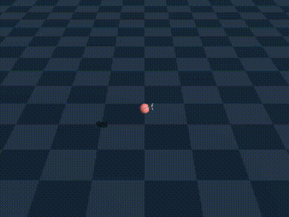
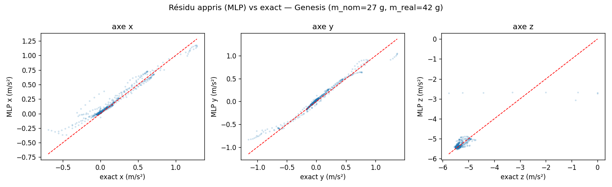
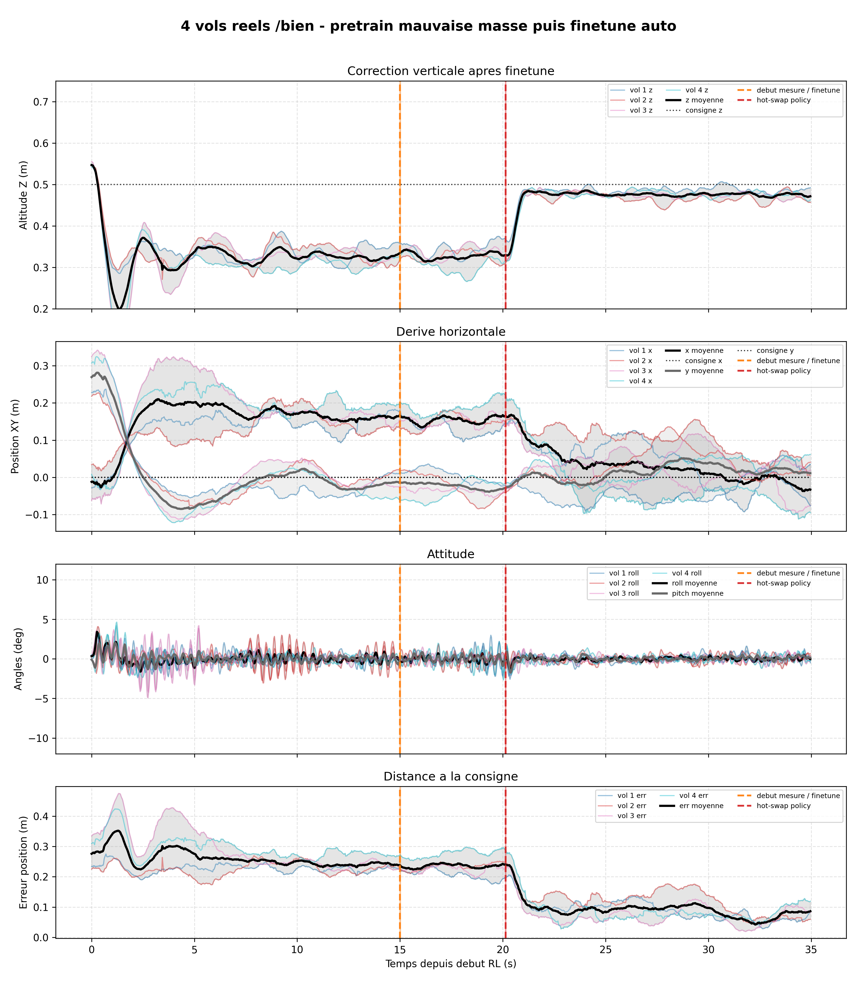
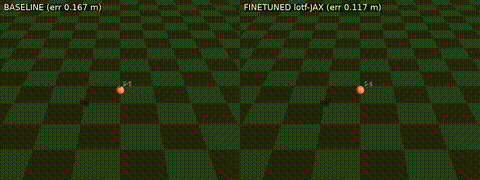
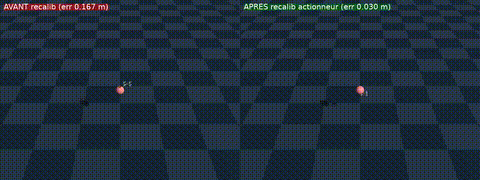

# Crazyflie LOTF — Sim-to-Real RL Flight Control

A reinforcement-learning flight controller for the [Bitcraze Crazyflie 2.0](https://www.bitcraze.io/products/crazyflie-2-1/), trained in the [Genesis](https://genesis-embodied-ai.github.io/) simulator with PPO and transferred to real hardware — then adapted **online, mid-flight**, with [Learning on the Fly](https://arxiv.org/abs/2502.13478) (BPTT through a differentiable simulator) to correct sim-to-real model errors in seconds, without landing.

<p align="center">
  
  
</p>
<p align="center"><em>Genesis simulation — pretrained policy flying a drone heavier than expected (left) vs. the same policy right after online fine-tuning corrects for it (right).</em></p>

This branch is intentionally reduced to the Crazyflie test bench (`test_cf/`) and its supporting `lotf/` engine, so that this specific result — closing a controlled mass mismatch with online BPTT adaptation — is easy to read, run and reproduce end to end.

The full technical report (state of the art, complete ablations, reward shaping study, drone-soccer perspectives) is available in [`Rapport.pdf`](Rapport.pdf) (French, Polytechnique Montréal internship report).

---

## Table of Contents

1. [Quick Start](#part-1--quick-start)
2. [Method & Results](#part-2--method--results)
3. [Repository Layout](#repository-layout)

---

## Part 1 — Quick Start

### Requirements

- Python ≥ 3.12, [`uv`](https://docs.astral.sh/uv/)
- An NVIDIA GPU is recommended for JAX training and for Genesis
- A physical Crazyflie 2.0 + Crazyradio PA, only needed for the real-flight steps

Three separate virtual environments are used, and none of them are versioned — only the lock/config files needed to recreate them are kept in the repo.

```bash
# Root env: JAX/LOTF pretraining, fine-tuning, notebooks
uv sync

# Crazyflie radio env: cflib + real-time control
cd test_cf/RL-real
uv venv .venv --python 3.11
uv pip install torch numpy scipy matplotlib pandas cflib pynput pyyaml
cd ../..

# Genesis simulation env (install genesis-world per your OS/GPU, then activate before Genesis commands)
uv venv genesis_venv --python 3.11
genesis_venv/bin/python -m pip install genesis-world torch numpy scipy
```

### 1. Pretrain the policy

```bash
cd test_cf
../.venv/bin/python core/pretrain_lotf_jax.py --preset base27 --out models/model_pretrain.pt
```

Useful presets to probe a sim/real mass gap: `mass33`, `res27` (see `test_cf/README.md`).

### 2. Fly in Genesis

```bash
source ../genesis_venv/bin/activate
python core/lotf_genesis_eval.py --ckpt models/model_pretrain.pt --steps 15000
# add --no-viewer for headless runs
```

### 3. Online fine-tuning demo (hot-swap mid-flight)

```bash
python core/lotf_genesis_eval.py --ckpt models/model_pretrain.pt \
    --online-finetune --jax-python ../.venv/bin/python --steps 15000
```

Keys during the demo: `f` + Enter starts fine-tuning, `m` changes the simulated mass, `q` + Enter quits.

### 4. Fly the real drone

Clear area, Flow deck attached, fail-safe ready.

```bash
cd test_cf
RL-real/.venv/bin/python core/lotf_real_eval.py \
    --model models/model_pretrain.pt --session measurements/real/real_run
```

Keyboard controls in flight: hold `ENTER` as a dead-man switch (release = immediate kill), `SPACE` = controlled landing.

### 5. Real-world online fine-tuning

```bash
RL-real/.venv/bin/python core/lotf_real_eval.py \
    --model models/model_pretrain.pt --online-finetune \
    --jax-python ../.venv/bin/python --session measurements/real/real_run
```

### 6. Plots & diagnostics

```bash
cd test_cf
../.venv/bin/python -m jupyter nbconvert --to notebook --execute notebooks/courbes.ipynb \
    --output /tmp/courbes_executed.ipynb
../.venv/bin/python tests/verify_vs_gazebo.py
../.venv/bin/python tests/test_finetune_unit.py
```

The full command reference (all presets, flags, and the directory layout of `test_cf/`) lives in [`test_cf/README.md`](test_cf/README.md).

---

## Part 2 — Method & Results

### Why learn the controller

Classic PID cascades control a Crazyflie well in near-static hover but can't resolve the trade-off between precision and stability, and they can't absorb model errors (mass changes, motor wear, wind) without being re-tuned by hand. This project trains a **PPO** policy in simulation to do the same job, then studies how to close the resulting **sim-to-real gap** — both through a robust policy (domain randomization, reward shaping) and through **online adaptation** of the simulator itself while the drone is flying.

### RL setup

| | |
|---|---|
| Simulator | [Genesis](https://genesis-embodied-ai.github.io/) — GPU-parallel, 8192 environments, 100 Hz control step |
| Observation (37-d) | relative position to target, orientation quaternion, linear/angular velocity, 6-step action history |
| Action | roll, pitch, yaw-rate, thrust — normalized to `[-1, 1]`, the zero action maps exactly to hover thrust |
| Control level | attitude (a full cascaded PID, matching the Crazyflie firmware, is re-implemented in-sim to convert attitude → motor RPM) |
| Algorithm | PPO, actor-critic `[64, 64]` (tanh), curriculum learning |
| Reward | exponential position/altitude/attitude tracking − action-smoothness penalty − crash penalty |
| Training cost | ~500 iterations, ≈ 7 minutes on a single GPU |

On real hardware, the learned policy reaches **comparable or better performance than the stock Bitcraze PID**: roughly 6 cm horizontal error vs. 5 cm for PID, but attitude oscillations cut from **6° to 2.5° peak-to-peak** and no altitude oscillation — the RL policy trades a small amount of static precision for a much smoother, more stable flight. Full comparison plots and numbers are in the report.

This classic PPO-in-Genesis training and sim-to-real transfer — the first part of the underlying report (simulator setup, reward shaping, domain randomization, PID vs. RL comparison) — has its own dedicated repo: **[remi5035/Crazyflie-2.0-Sim2Real](https://github.com/remi5035/Crazyflie-2.0-Sim2Real.git)**. This branch builds on that policy and focuses specifically on the online Learning-on-the-Fly adaptation described below.

### Learning on the Fly: adapting the simulator mid-flight

> 🚧 **Work in progress.** The residual-acceleration model below is still being tuned — the fit shown is an early checkpoint, not a finished result. The rest of this section describes the intended method and the current, partial validation.

Rather than only making the policy robust up front, [Learning on the Fly](https://arxiv.org/abs/2502.13478) closes the sim-to-real gap **after** deployment, in real time. The drone is modeled as a 6-DoF point mass; a small residual-acceleration network `f_θ(s, a)` is fit online to the mismatch between commanded and observed acceleration, then immediately folded into a **differentiable simulator** used to re-train the policy by backpropagation through time (BPTT) — a full re-training pass in about 10 seconds, instead of a full offline PPO run.

To exercise this loop, the policy is deliberately pretrained with an under-estimated mass (**27 g** instead of the real **42 g**, the effective mass once motor wear/PWM calibration is folded in). Flying this policy produces a large steady-state altitude error; the residual network is then fit to the resulting thrust bias purely from flight data:

<p align="center">
  
</p>
<p align="center"><em>Learned residual acceleration (MLP) vs. the exact residual computed from ground truth, on a real flight. The fit captures the constant ≈ −5.5 m/s² bias on the vertical axis reasonably well (the thrust deficit from the 27 g → 42 g mass error), but still drifts from the ideal diagonal at the extremes on the horizontal axes — tuning this fit is ongoing.</em></p>

Even with this imperfect residual, hot-swapping the policy already recovers most of the altitude error, without landing:

<p align="center">
  
</p>
<p align="center"><em>4 real Crazyflie flights, mean ± spread. Orange line: start of the 10 s data-collection window used for the online fit. Red line: hot-swap to the fine-tuned policy. The steady-state altitude error (target 0.5 m) collapses immediately, and position error to target drops from ≈0.25 m to ≈0.08 m — with attitude and horizontal drift staying just as stable.</em></p>

The same effect is visible in Genesis, side by side with the un-adapted baseline:

<p align="center">
  
</p>
<p align="center"><em>Baseline policy (left, 0.167 m error) vs. the same policy after online BPTT fine-tuning (right, 0.117 m error) on a mis-specified mass.</em></p>

A second variant recalibrates the actuator model instead of the residual dynamics, closing the gap even further:

<p align="center">
  
</p>
<p align="center"><em>Baseline (left, 0.167 m error) vs. actuator recalibration (right, 0.030 m error).</em></p>

**Status:** a policy trained on a deliberately wrong physical model already recovers most of its altitude performance within a single ~15 s online adaptation cycle (10 s of data collection + ~5 s of BPTT re-training), on the real drone, with no manual re-tuning — but the residual model driving this correction is still being refined, so treat the numbers above as early, not final. This loop is the specific result this branch is built around — see [Part 1](#part-1--quick-start) to run it yourself, and `Rapport.pdf` for the broader study it's drawn from (reward shaping, domain randomization ablations, body-rate control, residual reinforcement learning, and more).

---

## Repository Layout

```text
.
├── test_cf/                     # Crazyflie pipeline: Genesis, real flight, fine-tuning, results
│   ├── core/                    # main reusable code
│   │   ├── lotf_genesis_eval.py #   Genesis entry point
│   │   ├── lotf_real_eval.py    #   real Crazyflie entry point
│   │   ├── lotf_online.py       #   shared learning-on-the-fly core
│   │   ├── pretrain_lotf_jax.py #   JAX pretraining
│   │   └── finetune_lotf_jax.py #   offline JAX fine-tuning
│   ├── RL-real/                 # legacy standalone Crazyflie port + shared primitives
│   │   ├── RL_policy.py         #   torch network, loaded by both Genesis and the real drone
│   │   ├── cf_params.py         #   physical constants (source of truth)
│   │   └── drone_state.py       #   27-dim observation + action FIFO
│   ├── models/                  # saved .pt checkpoints
│   ├── measurements/            # raw logs/CSV/NPZ (genesis/, real/)
│   ├── assets/                  # presentation assets only — figures/, gifs/, videos/
│   ├── notebooks/                # plotting/exploration notebooks
│   ├── tests/                    # unit tests, diagnostics, comparisons
│   ├── configs/lotf_config.yaml  # RL/fine-tuning/Genesis hyperparameters
│   └── docs/                     # article & project notes
├── lotf/                         # JAX/LOTF engine used by pretraining and fine-tuning
├── modele_drones/                # Crazyflie URDF/meshes for Genesis
├── pyproject.toml / uv.lock      # root JAX/LOTF environment
└── LICENSE
```

`test_cf/core/` is the best entry point to understand the current pipeline; `test_cf/RL-real/` remains necessary because `core/` reuses its stable building blocks (`cf_params`, `DroneState`, `RLPolicy`) so that Genesis and the real drone share the same observation/action conventions. See [`test_cf/README.md`](test_cf/README.md) for the full command reference and directory notes.

## License

See [`LICENSE`](LICENSE).
